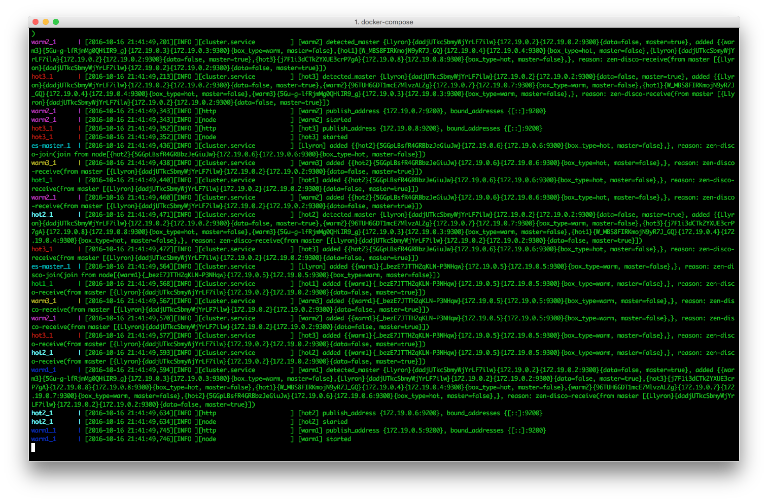
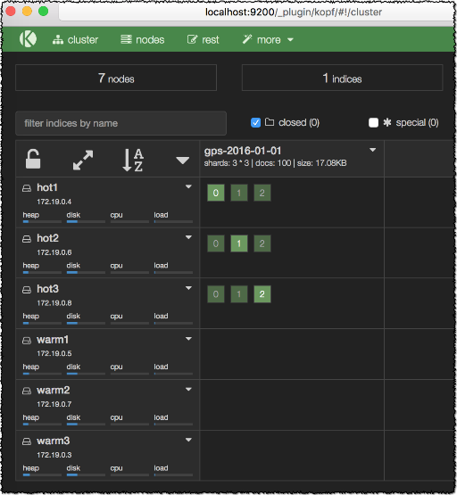
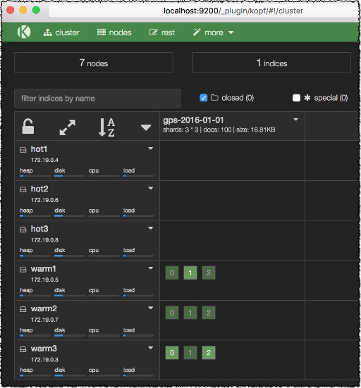

## ES Hot Warm

[This](https://www.elastic.co/blog/hot-warm-architecture) link discuss a multi temperature storage and search environment. This [Docker](https://docs.docker.com/) based project enables me to test and experience the movement of indices from `hot` to `warm`.

Build the image based on [Elasticseach:2.4](https://hub.docker.com/_/elasticsearch/) and the [Kopf](https://github.com/lmenezes/elasticsearch-kopf) plugin.

```
docker build -t es-kopf .
```

Using [docker-compose](https://docs.docker.com/compose/), we start a master node, 3 data nodes of type `hot` and 3 data nodes of type `warm`.
The node type is defined using the property `es.node.box_type` when starting the elasticsearch daemon.

```
docker-compose up
```



Once the cluster is up, navigate to <http://localhost:9200/_plugin/kopf/#!/cluster> to see the cluster nodes, or:

```
curl localhost:9200/_cat/nodes
```

Put the content of `gps.json` to define a template named `gps`, where any newly created `gps-*` index will be created in nodes of type `hot`: 

```
curl -XPUT localhost:9200/_template/gps?pretty -d @gps.json
```

Let's populate some data:

Install the [elasticsearch](https://elasticsearch-py.readthedocs.io/en/master/) client python module.

```
pip install elasticsearch
```

Load 100 random gps documents:

```
python gps.py
```



We can see in the above snapshot that the index and its replicas were all created in the `hot` nodes.

Let's relocate the index to the `warn` nodes:

```
curl -XPUT localhost:9200/gps-*/_settings?pretty -d '
{
  "index.routing.allocation.require.box_type": "warm"
}
'
```



And Voila !!! Pretty AWESOME.

Stop the cluster:

```
docker-compose stop
```

Remove all the containers:

```
docker rm $(docker ps -a -q)
```
